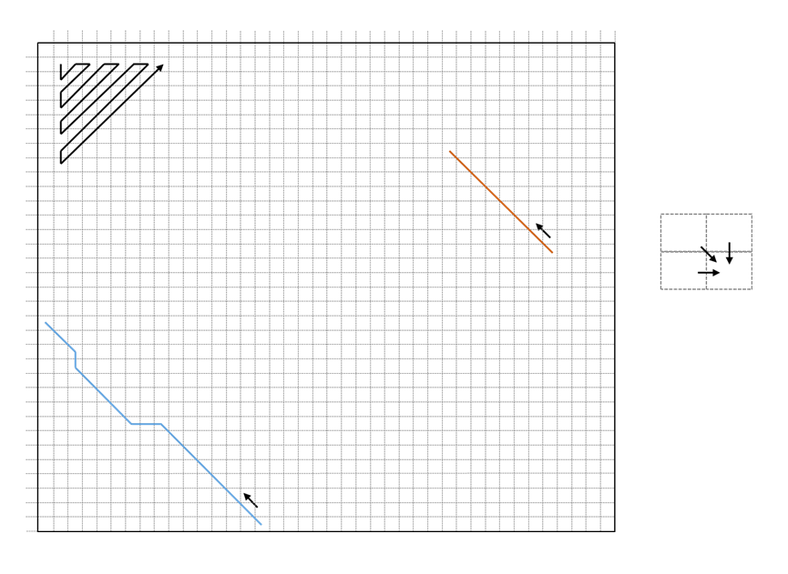

[](https://travis-ci.com/lbcb-edu/BSc-project-19-20)

# BSc project (computer science - 2019/2020)

Software Design Project is a course held at University of Zagreb, Faculty of Electrical Engineering and Computing in the fifth semester of the undergraduate study. The main focus is to promote cooperation between students while solving specific problems. Under the supervision of professor Mile Šikić and assistant professor Krešimir Križanović, students will get familiar with C++, basics of compilation methods, version control, unit tests and continuous integration, and will be introduced to algorithms used in bioinformatics. This project will be executed in several steps, each with defined outcomes which are required for succeeding steps. Instructions and guidelines for the project will be written in this README file which will be updated through the semester.

## Preliminaries

Students are required to get through the following tutorials: [C++](http://www.cplusplus.com/doc/tutorial/), [GitHub](http://rogerdudler.github.io/git-guide/), [CMake](https://cmake.org/cmake-tutorial/), [Googletest](https://github.com/google/googletest/blob/master/googletest/docs/primer.md) and [TravisCI](https://docs.travis-ci.com/user/getting-started/). While writing C++ code, it is advised to follow the [Google C++ style guide](https://google.github.io/styleguide/cppguide.html).

Students will be assigned to one of five teams which are **blue**, **brown**, **orange**, **pink** and **white**. Each team will have a separate branch and only team members will have write permission. Although, additional branches can be created if needed, but should have names starting with the team name (e.g. `blue_feature_one`).

## Objective

At the end of the project, students will have implemented several libraries which will enable alignment of a large amount of substrings (of various sizes) to a much larger string from which they originate. The objective is to join these libraries into a single program, often called mapper, in order to map long erroneous fragments from third generation of sequencing technologies to a reference genome, which has various use cases in bioinformatics. A visual example can be seen bellow.


## Setup

Each team's main branch should be up to date with this README. This can be achieved by merging the master branch or rebasing onto it. The setup of the projects consists of creating a program and naming it in form of `<team name>_mapper` (e.g. `blue_mapper`). The program has to accept two files as floating arguments and enable options `-h` (`--help`) and `-v` (`--version`), which are used for the help and version messages, respectively. Suggested argument parser to include is `optarg`, but this feature can also be implemented independently.

The first file will contain a set of fragments in [FASTA](https://en.wikipedia.org/wiki/FASTA_format) or [FASTQ](https://en.wikipedia.org/wiki/FASTQ_format) format, while the second one will contain a corresponding reference genome in FASTA format. The files need to be parsed and stored in memory, and some statistics have to be outputted to `stderr` which includes number of sequences, average length, minimal and maximal length etc. There is no need to implement a parser. Students can  add [bioparser](https://github.com/rvaser/bioparser) to the project as a submodule via `git` and integrate it with `cmake`. It supports several bioinformatics formats where files can also be compressed with `gzip`. Therefore, before passing file paths to `bioparser`, a check is needed whether file extensions are members of the following list: `.fasta`, `.fa`, `.fastq`, `.fq`, `.fasta.gz`, `.fa.gz`, `.fastq.gz`, `.fq.gz`.

Sample program runs, after the setup step is completed, can be seen bellow:

```bash
blue_mapper escherichia_coli_r7_reads.fastq escherichia_coli_reference.fasta
<basic statistics of input files>
```

```bash
blue_mapper -h
<appropriate message describing supported arguments>
```

```bash
blue_mapper -v
v0.1.0
```

## Data

The first version of the mapper will be tested on an Oxford Nanopore Technologies data set obtained by sequencing the Escherichia coli K-12 substr. MG1655 genome. The data set is freely available from Loman Labs [here](https://nanopore.s3.climb.ac.uk/MAP006-1_2D_pass.fasta), while the reference genome is freely available from NCBI [here](https://bit.ly/2PCYHWr).

## Alignment

The objective is to implement a library for pairwise sequence alignment. Sequence alignment is a series of transformations which describe how to obtain one sequence from the other. The main use case for it in bioinformatics is to find similar regions between DNA chains, RNA chains or proteins in order to infer evolutionary and functional relationships. Alignments can be found using dynamic programming algorithms, that simplifiy a complicated problem by breaking it into simpler subproblems in a recursive manner. Results of the subproblems are stored and used to reconstruct the final solution. Dynamic programming algorithms for sequence alignment, use a `(n + 1) * (m + 1)` matrix, where `n` and `m` are lengths of sequences that are being aligned. Each cell of the matrix stores the current best alignment score and can be calculated as the maximal score between the value of the upper cell plus the deletion cost, the value of the upper left cell plus the match or mismatch cost, and the value of the left cell plus the insertion cost. Once the matrix is completely filled, the optimal alignment can be found by backtracking from the best cell of the matrix. A visual example can be seen bellow.



There are several different versions of pairwise alignment algorithms, the Needleman-Wunsch algorithm for global alignment, the Smith-Waterman algorithm for local alignment and semi-global algorithms used for suffix-prefix and prefix-suffix alignments. The main differences between them are in the initialization step and the place from which the backtrack procedure can start.

As stated above, students have to create a library which implements all three alignment algorithms. The library should be named in form of `<team name>_alignment` (e.g. `blue_alignment`) and should have its own namespace called after the team (e.g. `blue`). The library has to be created with the same `CMakeLists.txt` file as the mapper, and eventually be linked to it. The implementation has no requirements (it can be just one function or through a class) but the alignment function should have the following prototype:

```cpp
int pairwise_alignment(const char* query, unsigned int query_length,
                       const char* target, unsigned int target_length,
                       AlignmentType type,
                       int match,
                       int mismatch,
                       int gap);
```

where the return value is the alignment score, `AlignmentType` is an `enum class` determining the alignment type (i.e. global, local or semi-global), while `match`, `mismatch` and `gap` represent match, mismatch and insertion/deletion cost respectively. There should also be an overloaded function with two additional arguments in which the [CIGAR](https://samtools.github.io/hts-specs/SAMv1.pdf) string of the alignment and the alignment begining position on the target sequence should be stored:

```cpp
int pairwise_alignment(const char* query, unsigned int query_length,
                       const char* target, unsigned int target_length,
                       AlignmentType type,
                       int match,
                       int mismatch,
                       int gap,
                       std::string& cigar,
                       unsigned int& target_begin);
```

Once the library is completed, it has to be used in the mapper which includes adding input arguments for the alignment type and match, mismatch and gap costs. Afterwards, two random sequences from the first input file have to be aligned and the resulting `CIGAR` string printed.

A good read for this part of the project is the second chapter of the Bioinformatics course held at University of Zagreb, Faculty of Electrical Engineering and Computing (located [here](https://www.fer.unizg.hr/_download/repository/bioinformatika_skripta_v1.2.pdf)).

## Unit tests and continuous integration

The alignment library, and all other code components to follow, should have a set of unit tests (using googletest added as a submodule) which are automatically run after each commit to the team branch (via TravisCI). Unit tests must be compiled on Ubuntu and macOS with both gcc and clang compilers. A success/failure badge for the integration should be placed in the README.

## Minimizers

The next step is to implement a library that for any DNA/RNA sequence returns its set of minimizers, which are specific small substrings of defined length *k* (often called *k*-mers). As alignment algorithms have quadratic complexity, *k*-mer indexing is often used for fast detection of similar regions between two sequences prior the exact alignment. However, collecting all *k*-mers can have a big impact on computational resources (both memory and execution time), especially choosing those that are quite frequent in a set of sequences. Considering only a subset of *k*-mers can alleviate the whole process while keeping reasonable levels of sensitivity. One such method are minimizers which are described [here](https://academic.oup.com/bioinformatics/article/20/18/3363/202143). 

The library should be named in a form of `<team name>_minimizers` (e.g. `blue_minimizers`) and should share its namespace with the alignment library (e.g. `blue`). Other constraints apply as well, it has to be created with the same `CMakeLists.txt`, it has to be linked to the mapper, and have its own unit tests which are run via TravisCI. The implementation has no requirements (it can be just one function or through a class) but the function for finding minimizers should have the following prototype:

```cpp
std::vector<std::tuple<unsigned int, unsigned int, bool>> minimizers(const char* sequence, unsigned int sequence_length,
                                                                     unsigned int k,
                                                                     unsigned int window_length);
```

where the return value is the list of found minimizers, their positions in the sequence and their origin (whether they are located on the original strand or the reverse complement), while parameters `k` and `window_length` are self explanatory (check minimizer paper).

Once the library is finished, it has to be used to find minimizers of all sequences in the first input file. The mapper has to print the number of distinct minimizers, fraction of singletons and the number of occurences of the most frequent minimizer when the top `f` frequent minimizers are **not** taken in account (add optional arguments for setting `k`, `w` and `f` to the mapper). Default values for `(k, w, f)` should be `(15, 5, 0.001)`.

## Disclaimer

Laboratory for Bioinformatics and Computational Biology cannot be held responsible for any copyright infringement caused by actions of students contributing to any of its repositories. Any case of copyright infringement will be promptly removed from the affected repositories and reported to appropriate faculty organs.
